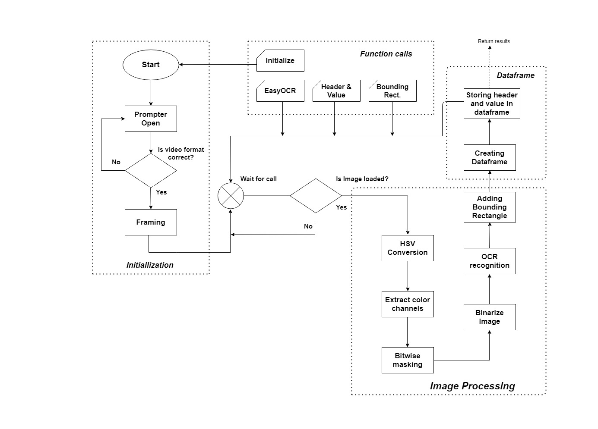

# Optical Character Recognition Using Patient Monitor Screen 
#
This project is about using image processing techniques to implement the object character recognition model to convert different patient records located in monitor screen into text form and store it in a dataframe format. 

# Implementation Roadmap
The idea is to be able to plug-in any state-of-the-art OCR model to better fit convert the required data of patient monitor screens into text form. Complete algorithm is shown below:




# Folders & Files description:
* Code Files
    * libraries.py : Imports Useful Libraries used in a project.
    * getFrame.py : Asks user to load video and convert video frames in the form of images.
    * pre-process.py : Pre-processing steps including HSV conversion and Color Masking.
    * OCR_implementation.py : Implemention of OCR model on generated frames.
    * create_dataframe.py : Storing the results of OCR into dataframe.
    * main.py : Setting of parameters and recall of all the functions.
* Input File
  * Video file
* Images
    * Frames extracted from video input file
* Output
    * values stored in the form of .csv file. 

# Requirements
The code for the OCR from Patient Monitor screen needs to be downloaded from [this repository]() and extracted into the folder. A sample video is also located in a video folder.

## Required Python Libraries
- [numpy](http://www.numpy.org/)
- [matplotlib](http://matplotlib.org/)
- [cv2](https://pypi.org/project/opencv-python/)
- [os](https://docs.python.org/3/library/os.html)
- [easyocr](https://pypi.org/project/easyocr/)
- [PIL](https://pypi.org/project/Pillow/)
- [glob](https://docs.python.org/3/library/glob.html)
- [promptlib](https://pypi.org/project/promptlib/)
- [re](https://docs.python.org/3/library/re.html)
- [collections](https://docs.python.org/3/library/collections.html)
- [csv](https://docs.python.org/3/library/csv.html)
- [pandas](https://pandas.pydata.org/)

# Usage
In order to run this project the attributes and video have to be downloaded and extracted. Further, the filepaths in __getFrame.py__ and __main.py__ have to be updated accordingly to the local directory path.

Initially, this model has been implemented mainly to extract features based on four different colors: Red, Green, Yellow and White. To add extra color schemes or modify the existing color pattern, lower and upper mask values of different color functions has to be changed in __pre-processing.py__ file. 

After setting up the parameters and mentioned file paths, run the main.py file. In case you do not have GPU or your GPU has low memory, you can run it in CPU mode by adding gpu = False and add the following command in libraries.py
``` python
reader = easyocr.Reader(['en'], gpu = False)
```

# Acknowledgement
This project is based on researches/codes from several papers/open-source repositories.


# License
This project is open source project and could be use further for reaserach work under the reference given below:

Author. Bukhari, Syed Irtza Akhtar.
Year.2021
Title ('Optical Character Recognition from Patient Monitor Screen').
Level of Thesis. Masters
University. University of Stavanger
City.Stavanger, Norway
